# Node.js CI/CD, GitOps & Observability Platform

A production-style **CI/CD, GitOps, Kubernetes, and observability pipeline for a Node.js application**, demonstrating automated testing, static code analysis, containerization, Docker image publishing, Kubernetes manifest updates, continuous deployment to **Amazon EKS** using **Argo CD**, and application monitoring using **Prometheus and Grafana**.

The project is inspired by the Jenkins Zero To Hero CI/CD workflow by Abhishek Veeramalla and adapted for a lightweight Node.js application.

------------------------------------------------------------------------

## 🏗️ Architecture

### End-to-End CI/CD, GitOps & Observability Architecture

The following architecture shows the complete flow from a developer code push through Jenkins CI, SonarQube quality validation, Docker image publishing, Kubernetes manifest update, Argo CD synchronization, deployment to Amazon EKS, and application observability using Prometheus and Grafana.

<p align="center">

  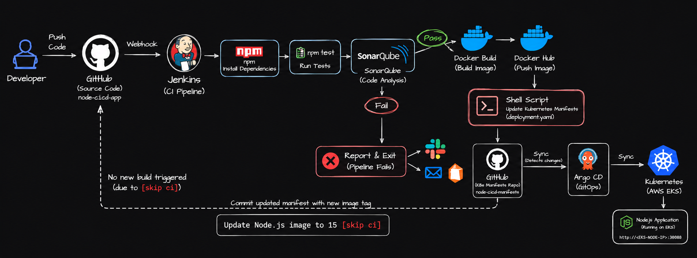

</p>

------------------------------------------------------------------------

## 🎥 Project Demo

Watch the complete project demonstration:

https://github.com/user-attachments/assets/546d1cbe-99a5-4f3b-a427-ea4e743add92

------------------------------------------------------------------------

## 🚀 Project Overview

This project implements an end-to-end DevOps workflow:

```text
Developer
    |
    | git push
    v
GitHub Repository
    |
    | Generic Webhook Trigger
    v
Jenkins
    |
    +--> npm ci
    |
    +--> npm test
    |
    +--> SonarQube Code Analysis
    |         |
    |         +--> Quality Gate FAIL --> Stop pipeline
    |
    +--> Docker Build
    |
    +--> Docker Push
              |
              v
          Docker Hub
              |
              v
       update-image.sh
              |
              v
   node-cicd-manifests/
              |
              | Git commit
              v
           Argo CD
              |
              | Sync
              v
      Amazon EKS / Kubernetes
              |
              v
       Node.js Application
              |
              | /metrics
              v
          Prometheus
              |
              v
           Grafana
```

The project uses a **single GitHub repository** containing both the Node.js application source code and Kubernetes manifests.

The pipeline separates **Continuous Integration**, **Continuous Deployment**, and **Observability**:

- **Jenkins** handles CI: build, test, code analysis, container build, and image publishing.
- **SonarQube** performs static code analysis and quality validation.
- **Docker Hub** stores versioned container images.
- A lightweight **Bash shell script** updates the Kubernetes image tag.
- **Argo CD** watches the Kubernetes manifests stored in Git and synchronizes changes to Kubernetes.
- **Amazon EKS** runs the containerized Node.js application.
- **Prometheus** collects application and Kubernetes metrics.
- **Grafana** visualizes the collected metrics through dashboards.

------------------------------------------------------------------------

# 🔄 CI/CD Workflow

## 1. Developer pushes code

A developer modifies the Node.js application and pushes the changes to GitHub.

```bash
git add .

git commit -m "Added version 1.0.4"

git push origin main
```

<p align="center">

  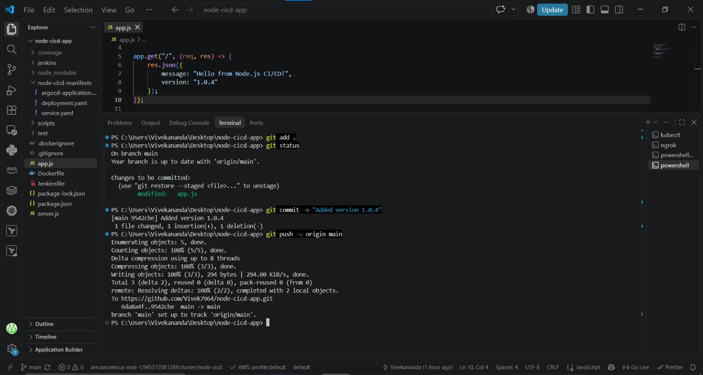

</p>

The GitHub push triggers the Jenkins pipeline.

------------------------------------------------------------------------

## 2. Jenkins starts the pipeline

Jenkins checks out the latest application source code from GitHub.

```text
GitHub
   |
   v
Jenkins
   |
   v
Checkout
```

Jenkins then executes the CI pipeline stages defined in the `Jenkinsfile`.

------------------------------------------------------------------------

## 3. Install dependencies

Jenkins executes:

```bash
npm ci
```

This installs dependencies from `package-lock.json` in a reproducible way.

Using `npm ci` ensures that the CI environment uses the dependency versions defined in the lock file.

------------------------------------------------------------------------

## 4. Run tests

The pipeline executes:

```bash
npm test
```

Jest and Supertest validate the Node.js application.

<p align="center">

  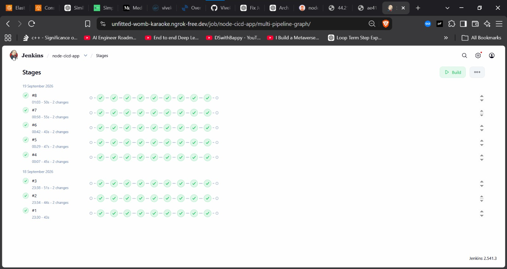

</p>

The tests validate application endpoints such as:

```text
GET /
GET /health
```

If tests fail:

```text
Pipeline
   |
   +--> Test FAILED
          |
          v
      Pipeline stops
```

No Docker image is released when the test stage fails.

------------------------------------------------------------------------

## 5. SonarQube analysis

The source code is analyzed by SonarQube for areas such as:

- Bugs
- Vulnerabilities
- Code smells
- Duplicated code
- Test coverage

A quality gate is used to decide whether the pipeline can continue.

<p align="center">

  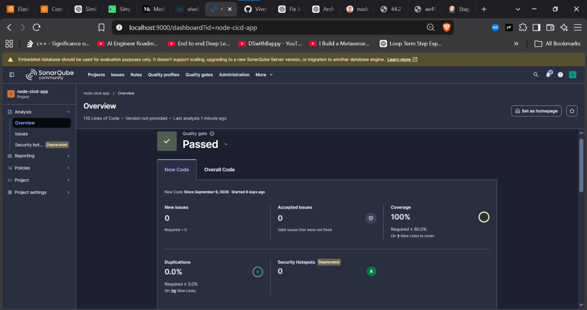

</p>

```text
SonarQube
    |
    +---- PASS ---> Docker Build
    |
    +---- FAIL ---> Report + Exit
```

The Docker image is built only after the required CI checks successfully complete.

------------------------------------------------------------------------

## 6. Build Docker image

After the quality checks pass, Jenkins builds the application image:

```bash
docker build -t <dockerhub-user>/node-cicd-app:08 .
```

The Jenkins build number is used as the Docker image tag so releases can be traced back to individual CI builds.

Example:

```text
node-cicd-app:05
node-cicd-app:06
node-cicd-app:07
node-cicd-app:08
```

This provides a simple versioning mechanism for container images.

------------------------------------------------------------------------

## 7. Push image to Docker Hub

Jenkins authenticates to Docker Hub using Jenkins credentials and pushes the build image:

```bash
docker push <dockerhub-user>/node-cicd-app:08
```

<p align="center">

  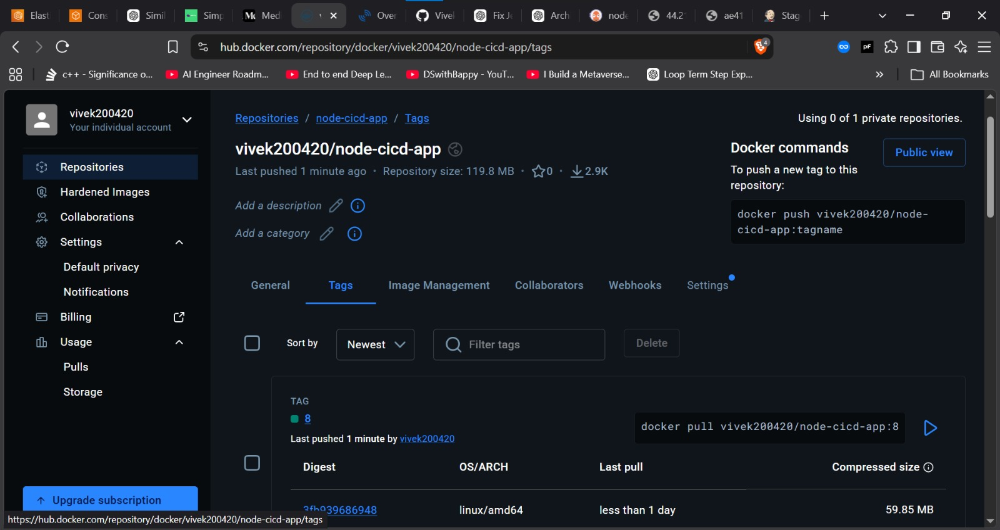

</p>

The image is now available for deployment to Kubernetes.

------------------------------------------------------------------------

# 🔀 GitOps Deployment

## 8. Update Kubernetes manifest

The Kubernetes manifests are maintained inside the **same GitHub repository** as the Node.js application.

The Kubernetes configuration is located under:

```text
node-cicd-manifests/
```

The Bash script updates the image tag in:

```text
node-cicd-manifests/deployment.yaml
```

Example:

```yaml
image: <dockerhub-user>/node-cicd-app:07
```

becomes:

```yaml
image: <dockerhub-user>/node-cicd-app:08
```

The script then:

1. Reads the Jenkins build number.
2. Updates the Docker image tag.
3. Commits the Kubernetes manifest change.
4. Pushes the change to GitHub.

Example:

```text
Jenkins Build #08
       |
       v
update-image.sh
       |
       v
deployment.yaml
       |
       v
GitHub
```

The Git commit uses `[skip ci]` to prevent the manifest update from unnecessarily triggering another CI pipeline.

Example:

```text
Update image to build 08 [skip ci]
```

<p align="center">

  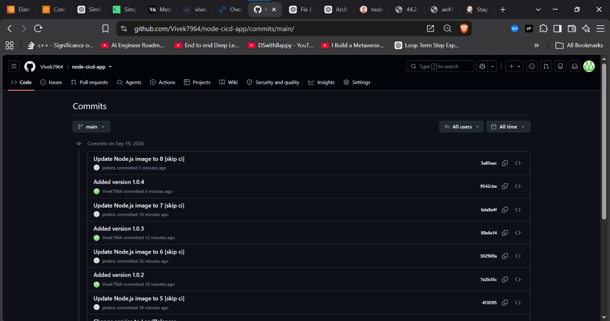

</p>

------------------------------------------------------------------------

## 9. Argo CD detects the Git change

Argo CD continuously monitors the Kubernetes manifests stored in the GitHub repository.

When the image tag changes:

```text
Git change
    |
    v
Argo CD
    |
    v
Sync
    |
    v
Kubernetes
```

<p align="center">

  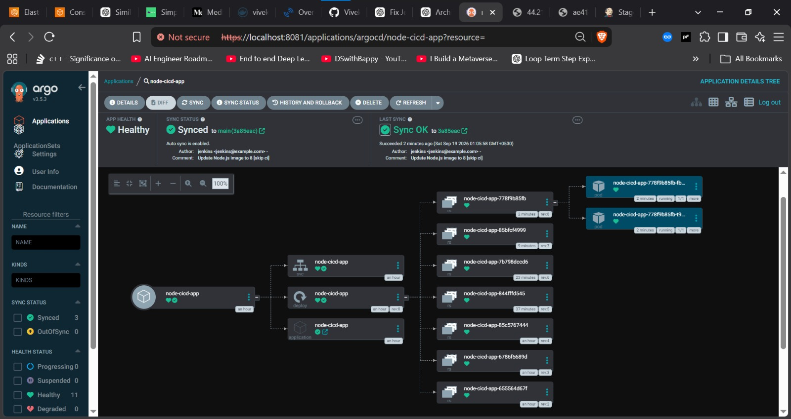

</p>

Argo CD compares the desired Kubernetes state stored in Git with the actual state running in the Amazon EKS cluster.

When a difference is detected, Argo CD synchronizes the application.

<p align="center">

  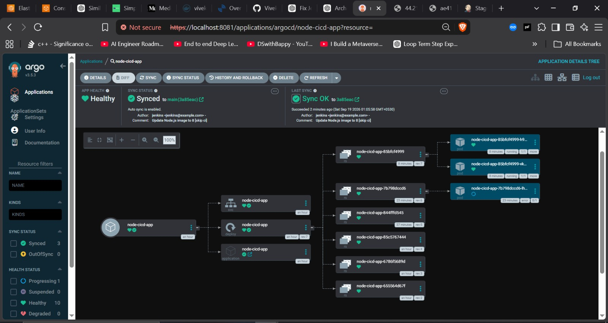

</p>

------------------------------------------------------------------------

# ☸️ Kubernetes Deployment

## 10. Kubernetes deploys the new version

Kubernetes updates the application deployment using the image tag specified in the Git-managed deployment manifest.

The application uses:

- Multiple replicas
- Resource requests
- Resource limits
- Readiness probes
- Liveness probes

Example:

```yaml
replicas: 2
```

<p align="center">

  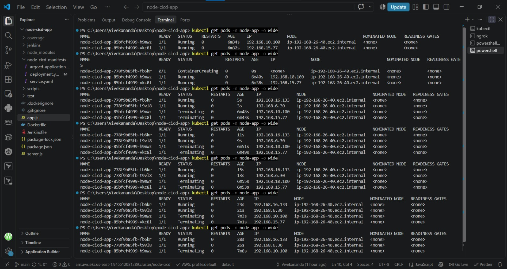

</p>

The application is exposed through a Kubernetes Service.

The request flow is:

```text
Internet
    |
    v
AWS Load Balancer
    |
    v
Kubernetes Service
    |
    v
Node.js Pods
    |
    v
Port 3000
```

The application can then be accessed through the AWS Load Balancer endpoint.

<p align="center">

  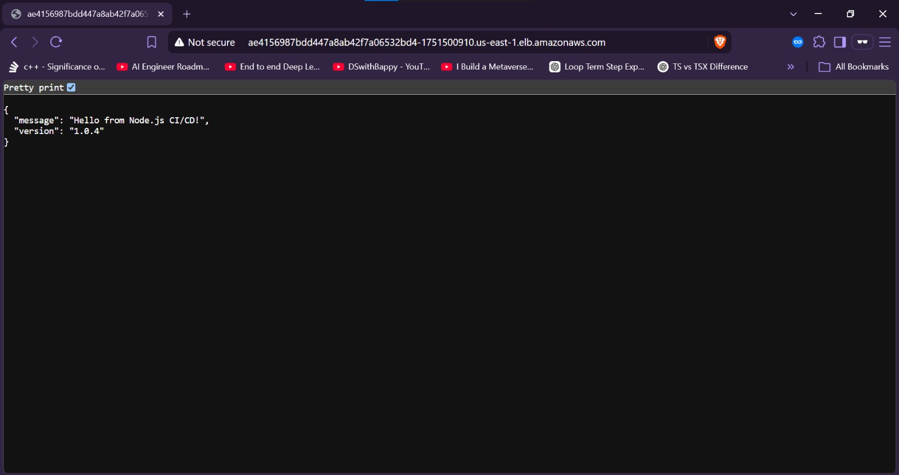

</p>

------------------------------------------------------------------------

# 📊 Observability

The project implements application and Kubernetes observability using:

- Prometheus
- Grafana
- Kubernetes ServiceMonitor
- Prometheus Node.js client
- PromQL
- Kubernetes metrics

The observability workflow is:

```text
Node.js Application
       |
       | /metrics
       v
ServiceMonitor
       |
       v
Prometheus
       |
       | PromQL
       v
Grafana
       |
       v
Observability Dashboard
```

------------------------------------------------------------------------

## 11. Prometheus collects application metrics

Prometheus collects metrics from the Node.js application through the `/metrics` endpoint.

The application exposes metrics such as:

- HTTP request count
- HTTP request rate
- Node.js memory usage
- Node.js CPU usage
- Process metrics

Prometheus uses a Kubernetes `ServiceMonitor` to discover the application and periodically scrape its metrics.

```text
Node.js Application
      |
      | /metrics
      v
ServiceMonitor
      |
      v
Prometheus
```

<p align="center">

  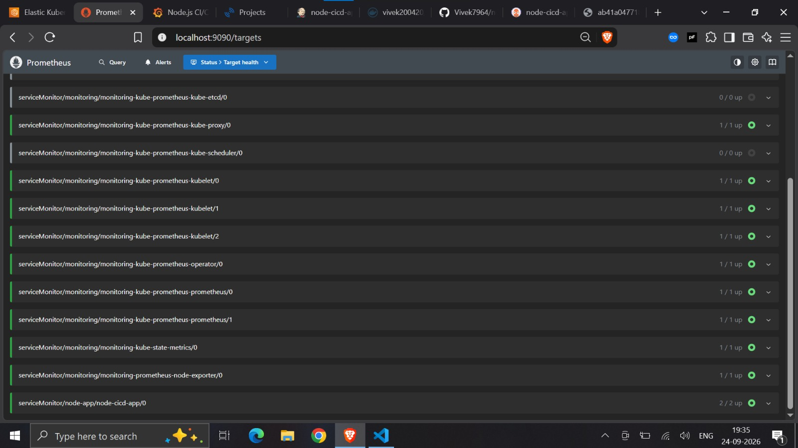

</p>

The Prometheus targets page shows that the Node.js application is successfully discovered and the target is in the **UP** state.

This confirms that Prometheus is successfully collecting metrics from the application running in Amazon EKS.

------------------------------------------------------------------------

## 12. Grafana visualizes application metrics

Grafana is connected to Prometheus and is used to visualize the application and Kubernetes metrics collected from the EKS cluster.

The Grafana dashboard displays metrics such as:

- HTTP request rate
- Total HTTP requests
- HTTP requests by status code
- Running pods
- Ready pods
- Node.js pod memory usage
- Pod CPU usage
- Pod memory usage
- Pod restart count

```text
Prometheus
    |
    | Metrics
    v
Grafana
    |
    v
Observability Dashboard
```

<p align="center">

  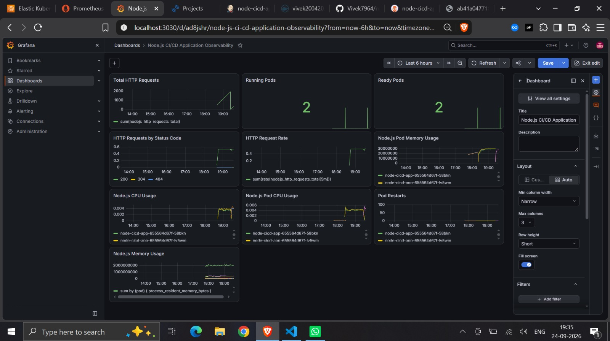

</p>

The Grafana dashboard provides a centralized view of application performance and Kubernetes resource health.

------------------------------------------------------------------------

## 13. Application observability

The final deployment provides observability for both the Node.js application and the Kubernetes environment.

```text
AWS EKS
   |
   +---- Node.js Application
   |           |
   |           | /metrics
   |           v
   |       Prometheus
   |           |
   |           v
   |        Grafana
   |
   +---- Kubernetes Metrics
```

Prometheus collects the metrics while Grafana provides dashboards for visualizing application traffic, pod health, resource usage, and other runtime information.

------------------------------------------------------------------------

# 📁 Repository Structure

## Application + Kubernetes Repository

The application source code and Kubernetes manifests are maintained in the **same GitHub repository**.

```text
node-cicd-app/

│
├── app.js
├── server.js
├── package.json
├── package-lock.json
├── Dockerfile
├── Jenkinsfile
├── sonar-project.properties
├── .gitignore
├── .dockerignore
├── README.md
│
├── scripts/
│   └── update-image.sh
│
├── node-cicd-manifests/
│   ├── deployment.yaml
│   ├── service.yaml
│   ├── servicemonitor.yaml
│   └── argocd-application.yaml
│
└── docs/
    │
    ├── architecture.png
    │
    └── screenshots/
        ├── 01-Github-commit-version-1.0.4.png
        ├── 02-jenkins-pipeline-webhook-trigger.png
        ├── 03-jenkins-stages-success.png
        ├── 04-sonarqube-analysis.png
        ├── 05-dockerhub-image.png
        ├── 06-kubernetes-pods.png
        ├── 07-kubernetes-service.png
        ├── 08-argocd-synced.png
        ├── 09-argocd-application.png
        ├── 10-running-application.jpeg
        ├── 11-gitops-commit.png
        ├── 12-webhook-loop-prevention.png
        ├── 13-prometheus-targets.jpeg
        └── 14-grafana-dashboard.png
```

------------------------------------------------------------------------

# 🧪 Node.js Application

The sample application provides simple endpoints.

## Application endpoint

```text
GET /
```

Example response:

```json
{
  "message": "Hello from Node.js CI/CD!",
  "version": "1.0.0"
}
```

## Health endpoint

```text
GET /health
```

Example response:

```json
{
  "status": "UP"
}
```

The `/health` endpoint is used by Kubernetes readiness and liveness probes.

## Prometheus metrics endpoint

```text
GET /metrics
```

The `/metrics` endpoint exposes Prometheus-compatible application metrics.

Example metrics include:

```text
nodejs_http_requests_total
process_resident_memory_bytes
process_cpu_user_seconds_total
```

This endpoint is scraped by Prometheus through the Kubernetes `ServiceMonitor`.

------------------------------------------------------------------------

# 🐳 Docker

Build locally:

```bash
docker build -t node-cicd-app:local .
```

Run:

```bash
docker run --rm -p 3000:3000 node-cicd-app:local
```

Test the application:

```text
http://localhost:3000
```

Health endpoint:

```text
http://localhost:3000/health
```

Metrics endpoint:

```text
http://localhost:3000/metrics
```

------------------------------------------------------------------------

# ☸️ Kubernetes Deployment

The Kubernetes configuration is stored under:

```text
node-cicd-manifests/
```

The directory contains:

```text
deployment.yaml
service.yaml
servicemonitor.yaml
argocd-application.yaml
```

The deployment contains:

- Multiple application replicas
- Resource requests and limits
- Readiness probe
- Liveness probe

Example:

```yaml
replicas: 2
```

The Kubernetes Service exposes the application.

The `ServiceMonitor` enables Prometheus to discover and scrape the application's `/metrics` endpoint.

------------------------------------------------------------------------

# ☁️ Amazon EKS

The application is deployed to an Amazon EKS cluster.

Typical deployment flow:

```text
Docker Image
     |
     v
Docker Hub
     |
     v
Argo CD
     |
     v
Amazon EKS
     |
     v
Kubernetes Deployment
     |
     v
Node.js Pods
     |
     +---- Service
     |
     +---- ServiceMonitor
              |
              v
          Prometheus
              |
              v
           Grafana
```

Useful commands:

```bash
kubectl get nodes

kubectl get pods -n node-app

kubectl get svc -n node-app

kubectl get deployment -n node-app
```

------------------------------------------------------------------------

# 🔱 Argo CD GitOps

Argo CD is responsible for continuous deployment.

The desired Kubernetes state is stored in the GitHub repository.

```text
GitHub Repository
      |
      | Desired Kubernetes State
      v
    Argo CD
      |
      | Reconciliation
      v
 Kubernetes Cluster
```

The Kubernetes manifests are located in:

```text
node-cicd-manifests/
```

Argo CD monitors these manifests and keeps the EKS cluster synchronized with the desired state stored in Git.

------------------------------------------------------------------------

# 🔁 Image Update Automation

Instead of adding another image-updater service, this project uses a lightweight shell script.

The script:

1. Reads the Jenkins build number.
2. Identifies the new Docker image tag.
3. Updates `node-cicd-manifests/deployment.yaml`.
4. Commits the manifest change.
5. Pushes the change to GitHub.
6. Argo CD detects the Git change.
7. Argo CD synchronizes Kubernetes.

Example:

```text
Jenkins Build #15
       |
       v
Docker Hub
       |
       v
node-cicd-app:15
       |
       v
update-image.sh
       |
       v
node-cicd-manifests/deployment.yaml
       |
       v
GitHub
       |
       v
Argo CD
       |
       v
EKS
```

------------------------------------------------------------------------

# 📈 Prometheus Monitoring

Prometheus is deployed inside the Kubernetes cluster and collects metrics from the Node.js application and Kubernetes environment.

The Node.js application exposes:

```text
/metrics
```

A Kubernetes `ServiceMonitor` configures Prometheus to discover the application.

```text
Node.js Application
       |
       | /metrics
       v
ServiceMonitor
       |
       v
Prometheus
```

Prometheus can be used to query application and Kubernetes metrics using PromQL.

### HTTP request rate

```promql
sum(rate(nodejs_http_requests_total[5m]))
```

### Total HTTP requests

```promql
sum(nodejs_http_requests_total)
```

### HTTP requests by status code

```promql
sum by (status_code) (
  rate(nodejs_http_requests_total[5m])
)
```

### Running pods

```promql
count(
  kube_pod_status_phase{
    namespace="node-app",
    phase="Running"
  }
)
```

### Ready pods

```promql
sum(
  kube_pod_status_ready{
    namespace="node-app",
    condition="true"
  }
)
```

### Pod memory usage

```promql
sum by (pod) (
  container_memory_working_set_bytes{
    namespace="node-app",
    container!="POD",
    container!=""
  }
)
```

### Pod CPU usage

```promql
sum by (pod) (
  rate(container_cpu_usage_seconds_total{
    namespace="node-app",
    container!="POD",
    container!=""
  }[5m])
)
```

### Pod restart count

```promql
sum by (pod) (
  kube_pod_container_status_restarts_total{
    namespace="node-app"
  }
)
```

------------------------------------------------------------------------

# 📊 Grafana Observability

Grafana is used to visualize the metrics collected by Prometheus.

The custom dashboard contains panels for:

```text
HTTP Request Rate
Total HTTP Requests
HTTP Requests by Status Code
Running Pods
Ready Pods
Node.js Pod Memory Usage
Pod CPU Usage
Pod Memory Usage
Pod Restart Count
```

The dashboard provides visibility into:

- Application traffic
- HTTP response status
- Pod availability
- Application resource usage
- Kubernetes resource usage
- Pod restart behavior

```text
Prometheus
     |
     | PromQL
     v
Grafana
     |
     v
Node.js CI/CD Application Observability
```

------------------------------------------------------------------------

# 🖥️ Local Development Setup

For a cost-conscious learning environment, Jenkins and SonarQube can run locally using Docker Desktop.

```text
Windows PC

│
├── Docker Desktop
│   ├── Jenkins
│   └── SonarQube
│
├── Node.js
├── Git
├── AWS CLI
└── kubectl
```

Argo CD, Prometheus, Grafana, and the Node.js application run inside the EKS cluster.

This keeps the CI tools local while demonstrating cloud-native deployment and observability on Amazon EKS.

------------------------------------------------------------------------

# 🚀 Running the Project Locally

## Clone

```bash
git clone https://github.com/<your-username>/node-cicd-app.git

cd node-cicd-app
```

## Install dependencies

```bash
npm ci
```

## Run tests

```bash
npm test
```

## Start application

```bash
npm start
```

Application:

```text
http://localhost:3000
```

Health endpoint:

```text
http://localhost:3000/health
```

Metrics endpoint:

```text
http://localhost:3000/metrics
```

------------------------------------------------------------------------

# 🛠️ Technology Stack

| Category | Technology |
|---|---|
| Application | Node.js |
| Framework | Express.js |
| Testing | Jest, Supertest |
| Source Control | GitHub |
| CI | Jenkins |
| Code Quality | SonarQube |
| Containerization | Docker |
| Image Registry | Docker Hub |
| Orchestration | Kubernetes |
| Cloud | AWS |
| Kubernetes Platform | Amazon EKS |
| GitOps | Argo CD |
| Monitoring | Prometheus |
| Visualization | Grafana |
| Metrics | PromQL |
| Service Discovery | ServiceMonitor |
| Automation | Bash Shell Script |
| Configuration | Kubernetes YAML |


------------------------------------------------------------------------

# 📄 License

This project is intended for educational and portfolio purposes.

------------------------------------------------------------------------

# 👨‍💻 Author

**Vivek**

GitHub: `https://github.com/Vivek7964`

LinkedIn: `https://www.linkedin.com/in/bukkasamudram-vivekananda-reddy-244808294/`

------------------------------------------------------------------------
